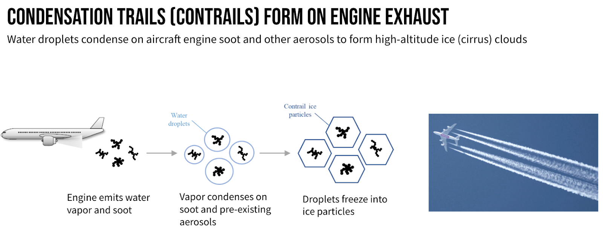

# Ensembling in semantic Image Segmentation

  

  <i>Source: Kaggle</i>

Avoiding condensation trails, clouds of ice crystals that form in the exhaust of aircraft engines, is an effective sustainability strategy for airlines. Persistent contrails contribute to global warming by trapping heat in the atmosphere. Scientists have developed models to predict the formation and impact of condensation trails and are validating their predictions with satellite images.

The goal of this contest was to improve corresponding prediction models by verifying the accuracy of those models using satellite imagery. There this was a semantic segmentation task.

## Segmentation Models

From the ``segmentation-models-pytorch`` library, we considered the following nine base models:

- **Unet**: A popular model for semantic segmentation tasks, consisting of a contract phase and an extension phase to capture context and localization.
- **Unet++**: An extended version of Unet that adds nesting and dense connections for improved segmentation performance.
- **MAnet**: A model based on multiple layers of attention to better highlight different features of the input data.
- **Linknet**: A lightweight, fast, and accurate model for recovering high-resolution features from low-resolution features.
- **Feature Pyramid Network** (FPN): A model that generates a pyramid of fast features with different scales for object detection and segmentation.
- **Pyramid Scene Parsing Network** (PSPNet): A network that aims to accurately segment complex scenes by using a pyramid pooling layer to aggregate contextual information.
- **Path Aggregation Network** (PAN): A model that aims to improve the flow of information in the network by connecting lower level features to higher levels to achieve better segmentation results.
- **DeepLabV3**: An improved version of the DeepLab model that uses dilated convolution and a new module structure (Atrous Spatial Pyramid Pooling) to achieve segmentations with high accuracy.
- **DeepLabV3+**: A further improvement of DeepLab that introduces an encoder-decoder structure to achieve more precise segmentation, especially at object edges.

## Ensembling Techniques

## Results
